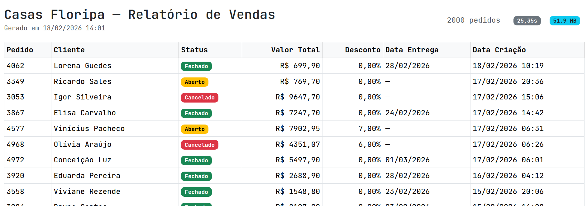
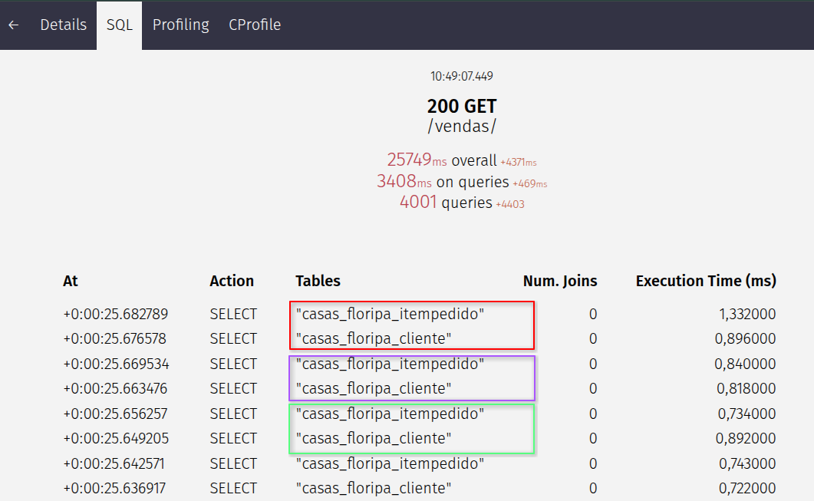
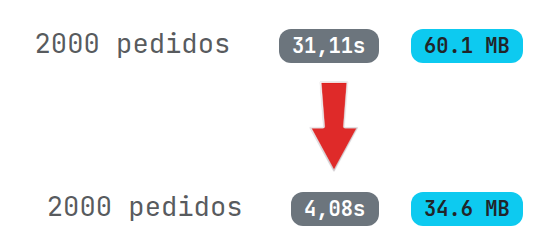
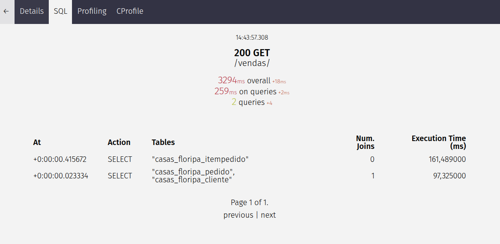
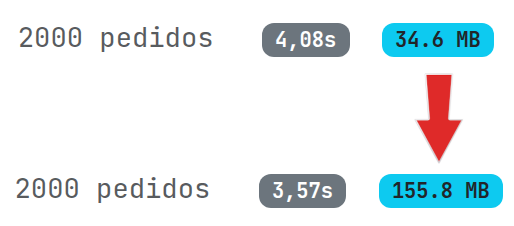
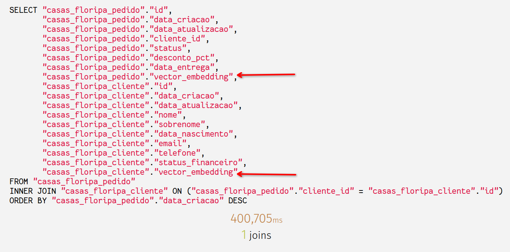
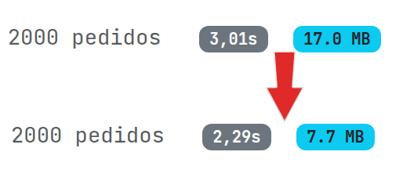
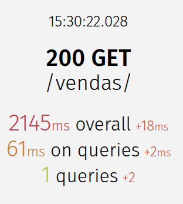

# ORMs com Python

Evitando os erros mais comuns.

<div style="display: flex; justify-content: space-between; margin-top: 2em; font-size: 0.7em; color: #888;">
  <span>Python Floripa 92</span>
  <span>rodrigo.vieira@gmail.com</span>
</div>

---

## O que são ORMs?

**ORM** = _Object-Relational Mapper_: mapeia objetos Python ↔ tabelas/linhas no banco

**Modelo (classe):**

```python
class Produto(ModelBase):
    nome = models.CharField(max_length=200)
    descricao = models.TextField()
    codigo_fabricante = models.CharField(max_length=50)
    preco = models.DecimalField(max_digits=10, decimal_places=2)
    # ...
```

---

## O que são ORMs?

Consultas feitas em notação orientada a objetos...

```python
from datetime import date
Produto.objects.filter(
  preco__lte=100,
  data_criacao__gte=date(2026, 1, 1)
)
```

<div class="fragment">
<p>..viram consultas SQL em tempo de execução</p>
<pre><code class="language-sql" data-trim>SELECT "id","nome","descricao","preco"
FROM "casas_floripa_produto"
WHERE ("preco" <= 100
       AND "data_criacao" >= '2026-01-01 00:00:00')</code></pre>
</div>

---

## Vamos criar um relatório de vendas

<a href="http://localhost:8000/vendas/" target="_blank" rel="noopener noreferrer">Relatório de vendas</a>


---

## Como o Django usa ORMs

```python
def vendas(request):
    pedidos = Pedido.objects.order_by("-data_criacao")

    return render(
        request,
        "casas_floripa/vendas.html",
        {"pedidos": pedidos},
    )
```

---

## Como o Django usa ORMs

```jinja
<tbody>
  
  <tr>
    <td>{{ pedido.id }}</td>
    <td>{{ pedido.cliente }}</td>
    <td>R$ {{ pedido.valor_total }}</td>
    <td>{{ pedido.desconto_pct }}%</td>
    <!-- ... mais colunas ... -->
  </tr>
  
</tbody>
```

---

## Por que tá meio lento? 🤔


---

#### Vamos ver as consultas ao banco de dados com <a href="http://localhost:8000/silk" target="_blank" rel="noopener noreferrer">Silk</a>



---

## N+1

<div style="font-size: 0.75em">

Para cada Pedido, são feitas duas consultas extra:

- Uma para dados do cliente em `pedido.cliente`
- Outra para `self.itens.all()` em `pedido.valor_total`

</div>

```jinja[2,5,6]
<tbody>
  
  <tr>
    <td>{{ pedido.id }}</td>
    <td>{{ pedido.cliente }}</td>
    <td>R$ {{ pedido.valor_total }}</td>
    <td>{{ pedido.desconto_pct }}%</td>
    <!-- ... mais colunas ... -->
  </tr>
  
</tbody>
```

---

## Como resolver?

Vamos incluir os dados do cliente e os itens do pedido na consulta original

```python[2-6]
def vendas(request):
    pedidos = (
        Pedido.objects.order_by("-data_criacao")
        .select_related("cliente")
        .prefetch_related("itens")
    )

    if "all" not in request.GET:
        pedidos = pedidos[:DEFAULT_LIMIT]

    return render(request, "casas_floripa/vendas.html", {"pedidos": pedidos})
```

---

## select_related vira um JOIN

Ou seja, os dados dos clientes são trazidos juntos de cada pedido

```sql
SELECT "pedido"."id",
       "pedido"."data_criacao",
      ...
       "cliente"."id",
       "cliente"."nome",
       "cliente"."sobrenome",
      ...
FROM "pedido" INNER JOIN "cliente"
  ON "pedido"."cliente_id" = "cliente"."id"
...
ORDER BY "pedido"."data_criacao" DESC

```

---

### Prefetch_related busca todos itens relacionados

```sql
SELECT "itempedido"."id",
       "itempedido"."data_criacao",
       "itempedido"."data_atualizacao",
       "itempedido"."pedido_id",
       "itempedido"."produto_id",
       "itempedido"."quantidade",
       "itempedido"."preco_venda"
FROM "itempedido"
WHERE "itempedido"."pedido_id" IN (
  9562,
  8849,
  ...,
  10279
)
```

---

### Como isso nos ajudou?



---

### Como isso nos ajudou?



---

### Tava tudo bem até uma feature nova aparecer

```python
class Produto(ModelBase):
    nome = models.CharField(max_length=200)
    descricao = models.TextField()
    # ... mais campos ...

    # campo novo para salvar o produto vetorizado
    vector_embedding = models.TextField(blank=True, null=True)
```

---

### Tava tudo bem até uma feature nova aparecer



---

### Por que a memória explodiu?



---

### Vamos pegar apenas os valores que a gente precisa

```python
def vendas(request):
    pedidos = (
        Pedido.objects.order_by("-data_criacao")
        .only(
            "id","status","desconto_pct","data_entrega",
            "cliente_id","cliente__nome",
            "cliente__sobrenome",
        )
        .select_related("cliente")
        .prefetch_related(
            Prefetch(
                "itens",
                queryset=ItemPedido.objects.only(
                    "pedido_id", "preco_venda", "quantidade"
                )))
      )

    return render(request, "casas_floripa/vendas.html", {"pedidos": pedidos})
```

---

### Podemos voltar pro boteco


---

### Mas dá pra melhorar um pouco mais?

Estamos calculando o valor total de cada pedido no Python, um a um 🥹

```python
@property
def valor_total(self):
    total = Decimal(
        sum(
            item.preco_venda * item.quantidade
            for item in self.itens.all()
        )
    )
    return total.quantize(Decimal("0.01"))
```

..e o banco de dados pode fazer essas contas pra gente

---

### Campos calculados com annotate()

```python[11-15]
def vendas(request):
  pedidos = (
    Pedido.objects.order_by("-data_criacao")
    .only(
      "id",
      "status",
      ...
      "cliente__sobrenome",
    )
    .select_related("cliente")
    .annotate(
        valor_total_calc=Sum(
          F("itens__preco_venda") * F("itens__quantidade")
        )
    )
  )
    ...
```

---

### Valeu banquinho!

```sql[7,8 ]
SELECT "pedido"."id",
  "pedido"."data_criacao",
  "pedido"."cliente_id",
  "pedido"."status",
  "pedido"."desconto_pct",
  "pedido"."data_entrega",
  SUM(("itempedido"."preco_venda" * "itempedido"."quantidade"))
      AS "valor_total_calc",
  "cliente"."id",
  "cliente"."nome",
  "cliente"."sobrenome"
FROM "pedido"
LEFT OUTER JOIN "itempedido" ON
  ("pedido"."id" = "itempedido"."pedido_id")
INNER JOIN "cliente" ON ("pedido"."cliente_id" = "cliente"."id")
ORDER BY "pedido"."data_criacao" DESC
```

---

### Valeu banquinho! Tô pagando pra isso



---

### ...e tem mais!

O prefetch_related também foi embora, porque ele tava sendo usado pra essa conta com os itens 🏆



---

### Como sair desse jogo de gato-e-rato?


